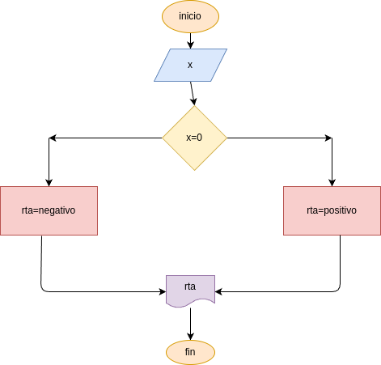

# numero_positivo
programa para calcular si un numero es pocitivo

## analisis

### variables de entrada
- x: digite un numero

### procediminto
if (x>0):
    rta = "positivo"
else:
    rta = "NEGATIVO O SERO"

## diseño

## construccion