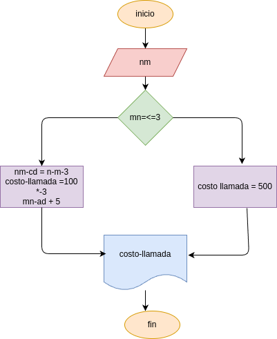

# tiempo_llamada
programa para calcular costo de una llamada

## analisis

### variables de entrada
digite la duracion de una llamada en minutos

### procedimiento
if (min <= 3):
    costo_llamada = 500
else:
    costo_llamada = 500 + (min - 3)*100

## diseño

## construccion
