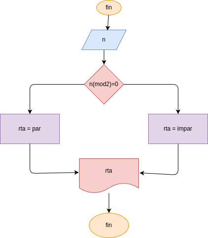

# numero_entero
programa para saver si un numero es entero

## analisis

### variables de entrada
digite un numero

### procedimiento
mod = x%2
if (mod == 0):
    rta = "par"
else:
    rta = "impar"

## diseño

## construccion
