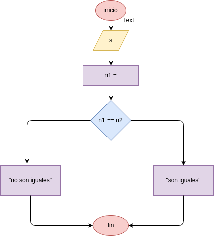

# dos_ultimos_digitos
programa para verificar si los dos ultimos digitos son iguales

## analisis

### variables de entrada
digite un numero

### procedimiento
ultimo_digito = x % 10
penultimo_digito = (x//10)%10
if (ultimo_digito == penultimo_digito):
    rta = "iguales"
else:
    rta = "diferentas"

## diseño

## construccion
