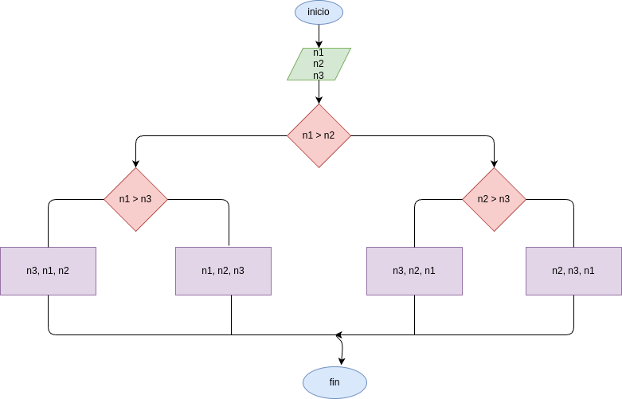

# dos_ultimos_digitos
programa para verificar si los dos ultimos digitos son iguales

## analisis

### variables de entrada
digite el valor de A
digite el valor de B
digite el valor de C

### procedimiento
if(A>C):
    if(A>C):
        rta=A
    else:
        rta=C
else:
    if(B>C):
        rta=B
    else:
        rta=C

## diseño

## construccion
