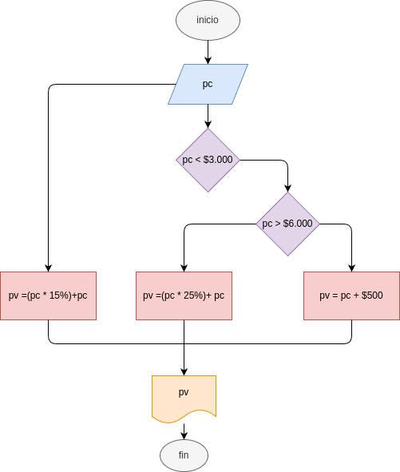

# precio_costo
programa en python para calcular el precio costo de un producto

## analisis

### variables de entrada
digite el precio costo del producto

### procedimiento
if(pc<3000):
    pv=(pc*0.15)+pc

else:
    if(pc>6000): 
        pv=(pc*0.25)+pc

    else:
        pv=pc+500

## diseño

## construccion