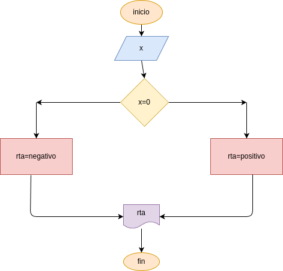
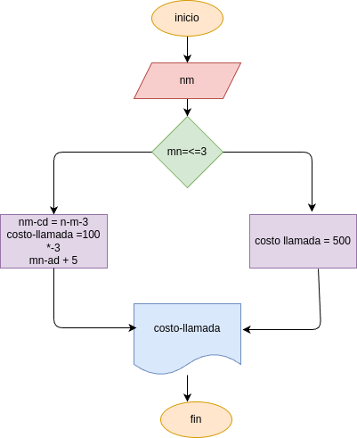
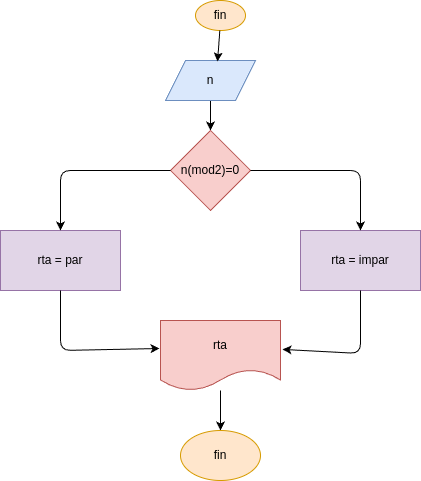
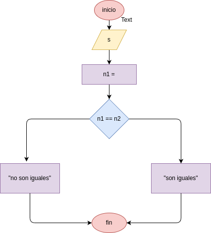
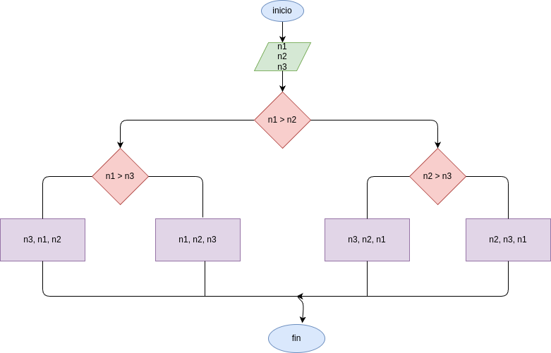
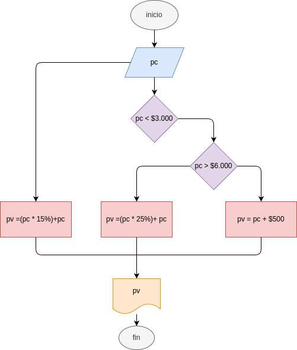

# taller_condicionales 
repositorio de los 6 ejercicios

## analisis

### variabe de entrada
- 1- x: digite un numero
- 2- digite la duracion de una llamada en minutos
- 3- digite un numero
- 4- digite un numero
- 5- digite el valor de A
digite el valor de B
digite el valor de C
- 6- digite el precio costo del producto

### procedimiento
1- if (x>0):
    rta = "positivo"
else:
    rta = "NEGATIVO O SERO"

2- if (min <= 3):
    costo_llamada = 500
else:
    costo_llamada = 500 + (min - 3)*100

3- mod = x%2
if (mod == 0):
    rta = "par"
else:
    rta = "impar"

4- ultimo_digito = x % 10
penultimo_digito = (x//10)%10
if (ultimo_digito == penultimo_digito):
    rta = "iguales"
else:
    rta = "diferentas"

5- if(A>C):
    if(A>C):
        rta=A
    else:
        rta=C
else:
    if(B>C):
        rta=B
    else:
        rta=C

6- if(pc<3000):
    pv=(pc*0.15)+pc

else:
    if(pc>6000): 
        pv=(pc*0.25)+pc

    else:
        pv=pc+500

## diseño
1- 

## diseño
2- 

## diseño
3- 

## diseño
4- 

## diseño
5- 

## diseño
6- 